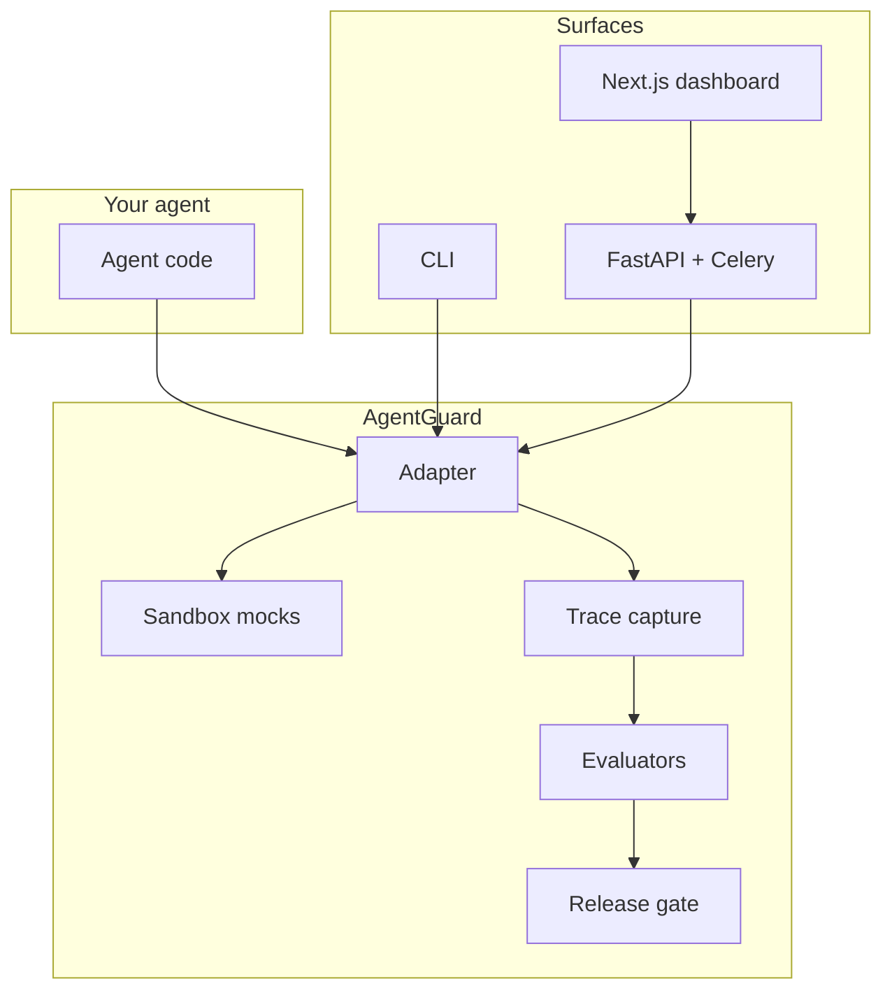

# AgentGuard

**Run 500 agent scenarios before deployment. Replay failures. Compare versions. Block unsafe releases.**

An open-source preflight and reliability platform for AI agents that take real-world actions — not a chatbot demo.

[](https://github.com/openjkai/agent-guard/actions/workflows/ci.yml)
[](https://github.com/openjkai/agent-guard/actions/workflows/release-gate.yml)

> **Hosted demo (coming soon):** [demo.agentguard.dev](https://demo.agentguard.dev) — placeholder for a public read-only dashboard.

## Why AgentGuard?

An agent that works in a demo is not necessarily safe to ship. AgentGuard gives you evidence-backed release decisions before production:

1. **Run scenarios** — YAML-defined tests with fixtures, tool mocks, and evaluators
2. **Capture traces** — LLM, tool, and retrieval steps with token cost and latency
3. **Replay failures** — deterministic cassettes reproduce bugs offline
4. **Compare versions** — prompt and model A/B with pass-rate and cost deltas
5. **Gate releases** — `SHIP` · `SHIP_WITH_WARNING` · `REQUIRE_HUMAN_REVIEW` · `BLOCK`

## Architecture



See [docs/architecture.md](docs/architecture.md) for the full system design.

## Status

All five build phases are complete for v0.1.

| Phase | Deliverable |
|-------|-------------|
| 1 | Engine, SDK, CLI |
| 2 | Refund demo — 50 scenarios, LangGraph adapter, benchmarks |
| 3 | FastAPI server, Postgres, Celery, SSE |
| 4 | Next.js dashboard — traces, reports, compare |
| 5 | Docs, CI gating, evaluation dataset, launch polish |

| Package | Path |
|---------|------|
| SDK + CLI | `packages/agentguard` |
| API server | `packages/server` |
| Dashboard | `packages/web` |
| Refund demo | `examples/refund-agent` |

## Quick start

```bash
git clone https://github.com/openjkai/agent-guard.git
cd agent-guard
make install

# Offline benchmark (no API keys)
make demo-dataset
make demo-benchmark

# Run one suite and gate it
uv run agentguard run \
  --config examples/refund-agent/benchmarks/prompt-v2-mock.yaml \
  --suite examples/refund-agent/scenarios \
  --agent examples/refund-agent/agent/simple_agent.py

uv run agentguard gate <suite-id> \
  --config examples/refund-agent/benchmarks/prompt-v2-mock.yaml
```

Full guide: **[docs/QUICKSTART.md](docs/QUICKSTART.md)**

### CI release gate

```yaml
# .github/workflows/release-gate.yml (included in repo)
- run: uv run python scripts/release_gate_check.py \
    --config examples/refund-agent/benchmarks/prompt-v2-mock.yaml \
    --suite examples/refund-agent/scenarios \
    --agent examples/refund-agent/agent/simple_agent.py \
    --expect SHIP
```

Exit code `30` = `BLOCK`. See [docs/datasets/refund-evaluation-dataset.md](docs/datasets/refund-evaluation-dataset.md).

### Docker (full stack)

```bash
make docker-up
# API → http://localhost:8000/docs
# Dashboard → http://localhost:3000
```

## Documentation

| Doc | Purpose |
|-----|---------|
| [docs/QUICKSTART.md](docs/QUICKSTART.md) | Install and first gated run |
| [docs/architecture.md](docs/architecture.md) | System design |
| [docs/ROADMAP.md](docs/ROADMAP.md) | What's next |
| [docs/demo-video-script.md](docs/demo-video-script.md) | 60–90s launch demo storyboard |
| [CONTRIBUTING.md](CONTRIBUTING.md) | Contributor workflow |
| [AGENTS.md](AGENTS.md) | Guidance for AI coding assistants |

## Development

```bash
make check          # lint + typecheck + test (Python)
make web-check      # lint + typecheck (dashboard)
make demo-gate      # offline release-gate smoke test
```

## License

MIT — see [LICENSE](LICENSE).
